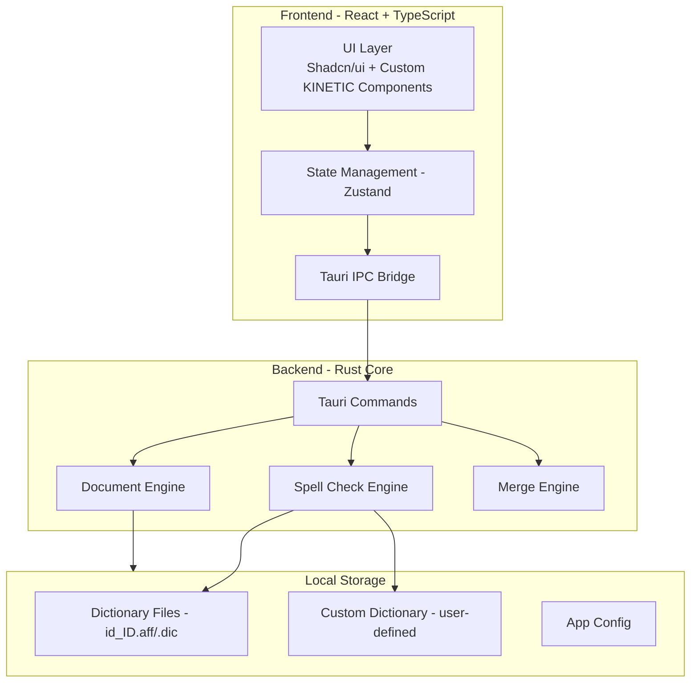
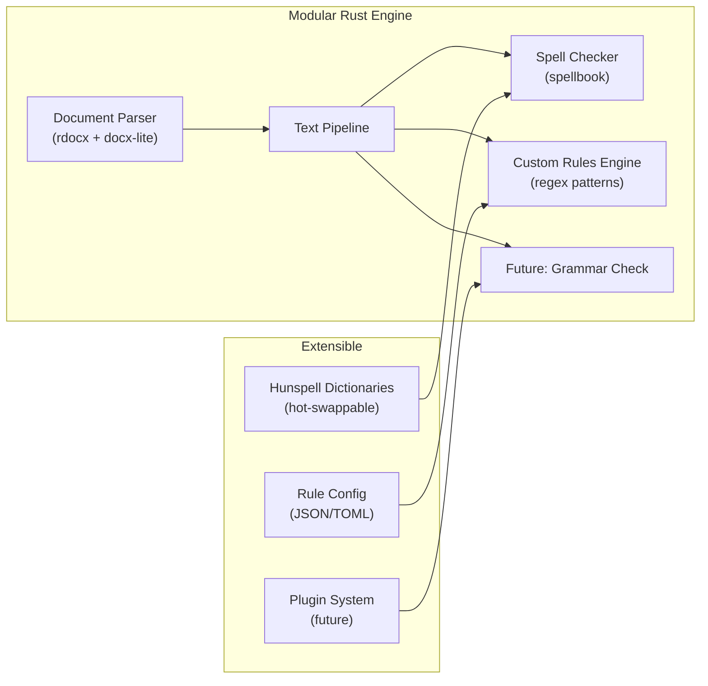
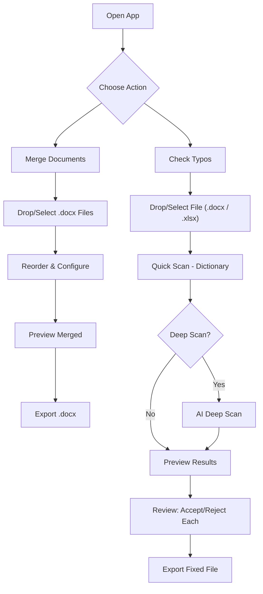

# 📝 DocFixer — Tauri App untuk Gabung & Cek Typo Dokumen

## Latar Belakang Masalah

Pain points yang perlu diselesaikan:

1. **Dokumen .docx berserakan** — perlu digabung jadi satu dokumen utuh
2. **Typo masif** — ditemukan 125+ kesalahan dalam satu dokumen (kata menempel, ejaan salah, spasi ganda, inkonsistensi penulisan, dll.)
3. **Proses manual** — saat ini harus minta tolong satu-satu atau pakai script Python, tidak scalable

## Konsep Aplikasi

**DocFixer** adalah desktop app yang memungkinkan user untuk:
1. **Drag & drop** beberapa file `.docx` → gabung jadi satu dokumen
2. **Auto-detect typo** dalam Bahasa Indonesia (dan opsional Bahasa Inggris)
3. **Review & approve** koreksi satu per satu atau batch
4. **Export** dokumen yang sudah diperbaiki dengan formatting asli tetap terjaga

---

## 🎨 Design System — "Tech Industrial / Editorial"

Design direction diambil dari referensi **KINETIC TYPE** yang diberikan user. Aesthetic: **dark cinematic, blueprint grid, industrial-precision UI dengan editorial typography.**

### Layout Constraints — Desktop Only

> [!IMPORTANT]
> App ini **desktop-only** (Tauri). Tidak ada responsive/mobile breakpoints. Semua layout di-optimize untuk layar desktop.

| Property | Value |
|---|---|
| **Min Window Size** | `1024 × 768` px |
| **Default Window Size** | `1280 × 800` px |
| **Max Window Size** | Fullscreen / mengikuti monitor |
| **Layout Type** | Fixed sidebar + main content (bukan stacked/mobile) |
| **Breakpoints** | Tidak ada — single desktop layout |
| **Font Scale** | Fixed, tidak perlu fluid typography |

```json
// tauri.conf.json > windows
{
  "title": "DocFixer",
  "width": 1280,
  "height": 800,
  "minWidth": 1024,
  "minHeight": 768,
  "resizable": true,
  "fullscreen": false,
  "decorations": true
}
```

**Layout Pattern:**
```
┌──────────────────────────────────────────────────────┐
│  NAVBAR (fixed top, full width)                      │
├────────────┬─────────────────────────────────────────┤
│            │                                         │
│  SIDEBAR   │         MAIN CONTENT                    │
│  (240px)   │         (flex-1, scrollable)             │
│            │                                         │
│  - Merge   │                                         │
│  - Check   │                                         │
│  - Dict    │                                         │
│  - Config  │                                         │
│            │                                         │
├────────────┴─────────────────────────────────────────┤
│  STATUS BAR (fixed bottom, optional)                 │
└──────────────────────────────────────────────────────┘
```

### Color Palette

| Token | Hex | Usage |
|---|---|---|
| `--bg-primary` | `#050505` | Background utama, deep black |
| `--accent-cyan` | `#06b6d4` | Primary accent — highlights, active states, borders, CTA hover |
| `--accent-lime` | `#bef264` | Secondary accent — badges, status indicators, kana-style decorations |
| `--text-primary` | `#F3F4F6` | Body text, headings |
| `--text-muted` | `white/50` | Secondary text (opacity 50%) |
| `--text-dim` | `white/30` | Tertiary text, corner marks |
| `--border-subtle` | `white/10` | Dividers, card borders, grid lines |
| `--border-hover` | `white/20` | Hover state borders |
| `--surface-card` | `white/[0.01]` | Card backgrounds (near-transparent) |
| `--surface-hover` | `white/[0.02]` | Card hover state |
| `--surface-nav` | `#050505/70` | Navbar background (backdrop-blur) |

### Typography

| Role | Font | Weight | Usage |
|---|---|---|---|
| **Display / Headings** | `Rajdhani` | 700 (Bold) | Section titles, hero text, large labels. UPPERCASE, tight tracking |
| **Mono / Technical** | `JetBrains Mono` | 400-500 | Labels, badges, nav links, code-like text. UPPERCASE, widest tracking |
| **Body / UI** | `Space Grotesk` | 400-500 | Paragraphs, descriptions, button labels, general UI text |

### Design Elements

#### Blueprint Grid Background (Global)
```css
/* Small grid */
background-image: linear-gradient(to right, rgba(255,255,255,0.03) 1px, transparent 1px),
                  linear-gradient(to bottom, rgba(255,255,255,0.03) 1px, transparent 1px);
background-size: 3rem 3rem;

/* Large grid overlay */
background-image: linear-gradient(to right, rgba(255,255,255,0.05) 1px, transparent 1px),
                  linear-gradient(to bottom, rgba(255,255,255,0.05) 1px, transparent 1px);
background-size: 12rem 12rem;

/* Vignette overlay */
background: radial-gradient(circle at center, transparent 10%, #050505 100%);
```

#### Corner Registration Marks
Kecil L-shaped borders di sudut setiap section/card:
```css
/* Top-left corner mark */
.corner-mark-tl {
  position: absolute; top: 0; left: 0;
  width: 0.75rem; height: 0.75rem;
  border-top: 1px solid rgba(255,255,255,0.3);
  border-left: 1px solid rgba(255,255,255,0.3);
}
/* Cyan variant for images/important areas */
border-color: #06b6d4;
```

#### Lift Cards (Hover Effect)
- `perspective(1000px) rotateX(2deg) translateY(-4px)` on hover
- Cyan glow shadow underneath: `rgba(6, 182, 212, 0.4)` blur 12px
- Bottom edge "light strip" that rotates into view
- Sweep animation: diagonal gradient that slides across on hover
- Corner ticks that animate inward on hover

#### Status Indicators
- Pulsing dot `w-2 h-2 bg-[#bef264]` with `shadow-[0_0_8px_rgba(190,242,100,0.4)]`
- Phase labels: `[01]`, `Phase A`, dll. in JetBrains Mono

#### Scan Line Effect
- Horizontal cyan line (`bg-[#06b6d4]/50`) that sweeps vertically across sections
- Used for loading/scanning states

#### Buttons
- **Primary CTA**: `bg-[#06b6d4] text-[#050505]` → hover `bg-white`
- **Secondary**: `border border-white/20 bg-transparent text-white` → hover `border-white`
- Both: `rounded-none` (sharp corners), `tracking-widest uppercase`, JetBrains Mono

#### Navigation Bar
- Fixed top, `backdrop-blur-md bg-[#050505]/70`
- `border-b border-white/10`
- Logo in Rajdhani (bold, tracking-widest)
- Links in JetBrains Mono (uppercase, tracking-widest, `text-white/60` → hover `text-[#06b6d4]`)

### Page-Specific Design

#### Home / Dashboard
- Hero area dengan app name besar (Rajdhani uppercase)
- Quick action cards (Merge / Check Typo) sebagai lift-cards
- Recent activity list dengan hairline dividers
- Blueprint grid background visible

#### Merge Page
- Dropzone: dashed `border-white/20`, corner marks, pulsing upload icon
- Document list: lift-cards dengan drag handle, filename, page count
- Merge config panel: bordered section with corner marks
- Preview: bordered frame with inset shadow

#### Spellcheck Page
- Document viewer: left panel, full-width text with inline highlights
  - **Error**: `bg-red-500/20 border-b-2 border-red-500`
  - **Warning**: `bg-yellow-500/20 border-b-2 border-yellow-500`
  - **Info**: `bg-blue-500/20 border-b-2 border-blue-500`
- Typo review panel: right sidebar, list of findings
- Accept: cyan button, Reject: ghost button, Ignore: dim link
- Progress bar: thin line `bg-[#06b6d4]` with lime percentage label

#### Scanning Animation
- Fullscreen overlay with scan-line sweeping top to bottom
- Phase HUD in top-left corner (JetBrains Mono, `text-[#06b6d4]`)
- Document filename in center, pulsing
- Stats counting up in real-time

### Micro-Animations

| Element | Animation | Easing |
|---|---|---|
| Page enter | `y: 24 → 0, opacity: 0 → 1, skewY: 6 → 0` | `power3.out` |
| Card hover | `perspective rotateX + translateY` | `cubic-bezier(0.19, 1, 0.22, 1)` |
| Sweep on hover | Diagonal gradient slides left-to-right | `cubic-bezier(0.19, 1, 0.22, 1)` |
| Corner ticks | Animate inward from outside on hover | `cubic-bezier(0.19, 1, 0.22, 1)` |
| Phase borders | `scaleX: 0 → 1` from left/right origins | `duration-700` |
| Scan line | `top: 0 → 100%` | `power2.inOut` |
| Toast notifications | Slide up from bottom | `power3.out` |

### UI Mockups (Concept)

> [!NOTE]
> UI mockups tersedia sebagai referensi visual. Design mengikuti aesthetic KINETIC TYPE: dark cinematic, blueprint grid, industrial-precision UI.

---

## Arsitektur Sistem



---

## Tech Stack & Dependencies

### 🦀 Backend — Rust (src-tauri)

> [!IMPORTANT]
> **Hasil Verifikasi:** Semua crate di bawah sudah diverifikasi keberadaannya di crates.io/lib.rs dan kompatibilitasnya.

| Crate | Fungsi | Status | Catatan |
|---|---|---|---|
| `tauri` 2.x | Framework desktop app | ✅ Stable, production-ready | First-class support React + Vite + TypeScript |
| `rdocx` | Baca/tulis/merge .docx | ✅ Active, pure Rust | Read + Write + Merge + Layout engine. Menggantikan `docx-rs` yang hanya write-only |
| `docx-lite` | Fast text extraction | ✅ Active, lightweight | Untuk scan cepat extract text. Streaming XML parser, low memory |
| `spellbook` | Spell checking (Hunspell-compatible) | ✅ Active, v0.2+ | **Menggantikan `zspell`** (stale). Punya `suggest` API. Dari Helix editor team |
| `tokio` 1.x | Async runtime | ✅ Standard | Non-blocking file I/O, dibutuhkan Tauri |
| `serde` + `serde_json` 1.x | Serialization | ✅ Standard | IPC data exchange frontend ↔ backend |
| `rayon` | Parallel processing | ✅ Stable | Multi-core text processing untuk dokumen besar |
| `regex` | Pattern matching | ✅ Stable | Deteksi pattern typo (spasi ganda, kata menempel, prefiks) |
| `zip` | Handle .docx internals | ✅ Stable | .docx = ZIP archive, low-level access jika diperlukan |

> [!WARNING]
> **Crate yang TIDAK dipakai (hasil verifikasi):**
> - ~~`docx-rs`~~ — **Hanya write-only**, tidak bisa baca/parse existing .docx. Diganti `rdocx`.
> - ~~`zspell`~~ — **Stale** (last release 0.5.5, tidak ada update). Diganti `spellbook`.
> - ~~`hunspell-rs`~~ — Butuh C library external (libhunspell). Kita mau pure Rust.

### ⚛️ Frontend — React + TypeScript (src/)

| Package | Fungsi | Alasan |
|---|---|---|
| `react` + `vite` | UI framework + bundler | Fast HMR, modern tooling |
| `typescript` | Type safety | Strict typing untuk IPC contracts |
| `@tauri-apps/api` | Tauri JS API | IPC, filesystem access, dialog |
| `tailwindcss` v4 | Styling | Rapid UI development |
| `shadcn/ui` | Component library | Professional, accessible UI components |
| `zustand` | State management | Simple, performant, minimal boilerplate |
| `lucide-react` | Icons | Consistent, modern icon set |
| `@tanstack/react-table` | Table/list view | Virtualized rendering untuk daftar typo panjang |
| `framer-motion` | Animations | Smooth micro-interactions, page transitions |
| `sonner` | Toast notifications | Clean feedback UX |
| `@dnd-kit/core` | Drag and drop | Reorder documents before merge |
| `gsap` | Scroll/complex animations | Scan-line, sweep, kinetic effects (sesuai referensi design) |

### 📚 Dictionary Files (Bundled)

| File | Fungsi |
|---|---|
| `id_ID.aff` | Affix rules Bahasa Indonesia |
| `id_ID.dic` | Kamus kata Bahasa Indonesia |
| `en_US.aff` | Affix rules English (opsional) |
| `en_US.dic` | Kamus kata English (opsional) |
| `custom.dic` | Kamus custom user (istilah medis, teknis, dll.) |

---

## 🖥️ Platform & Build Strategy

### Development: macOS (Primary)
Lo develop dan test di Mac. Semua tooling dan dev server berjalan di local Mac.

### Build: macOS + Windows (via CI/CD)

> [!IMPORTANT]
> **Tauri TIDAK support cross-compile** langsung dari Mac ke Windows. Solusinya: **GitHub Actions dengan Build Matrix** — setiap platform di-build di runner native masing-masing.

```yaml
# .github/workflows/build.yml
name: 'Build & Release'

on:
  push:
    tags:
      - 'v*'

jobs:
  build:
    permissions:
      contents: write
    strategy:
      fail-fast: false
      matrix:
        include:
          - platform: 'macos-latest'
            args: '--target aarch64-apple-darwin'  # Apple Silicon
          - platform: 'macos-latest'
            args: '--target x86_64-apple-darwin'   # Intel Mac
          - platform: 'windows-latest'
            args: ''                                # Windows x64
    runs-on: ${{ matrix.platform }}
    steps:
      - uses: actions/checkout@v4

      - name: Setup Node
        uses: actions/setup-node@v4
        with:
          node-version: lts/*

      - name: Install Rust stable
        uses: dtolnay/rust-toolchain@stable
        with:
          targets: ${{ matrix.platform == 'macos-latest' && 'aarch64-apple-darwin,x86_64-apple-darwin' || '' }}

      - name: Install frontend deps
        run: npm install

      - uses: tauri-apps/tauri-action@v0
        env:
          GITHUB_TOKEN: ${{ secrets.GITHUB_TOKEN }}
        with:
          tagName: v__VERSION__
          releaseName: 'DocFixer v__VERSION__'
          releaseDraft: true
          prerelease: false
          args: ${{ matrix.args }}
```

**Output per platform:**

| Platform | Output Format | Runner |
|---|---|---|
| macOS (Apple Silicon) | `.dmg`, `.app` | `macos-latest` |
| macOS (Intel) | `.dmg`, `.app` | `macos-latest` |
| Windows | `.msi`, `.exe` (NSIS) | `windows-latest` |

> [!TIP]
> **Workflow:** Lo develop & test di Mac → push tag `v1.0.0` → GitHub Actions otomatis build untuk Mac + Windows → download installer dari GitHub Releases.

### Scalability: Kenapa Arsitektur Ini Scalable



| Aspek | Bagaimana Scalable |
|---|---|
| **Dokumen besar** | `rayon` parallel processing, `docx-lite` streaming parser |
| **Bahasa baru** | Tinggal tambah `.aff` + `.dic` file (Hunspell format universal) |
| **Rules baru** | JSON/TOML config file untuk custom typo patterns, tanpa recompile |
| **Fitur baru** | Modular command system — tambah Tauri command baru tanpa ganggu existing |
| **Multi-user** | Custom dictionary per-user, settings per-user via Tauri `app_data_dir` |
| **Platform baru** | Linux tinggal tambah row di CI matrix. Mobile (future) bisa pakai Tauri 2.x mobile support |

---

## Fitur Utama

### 1. 📂 Document Combiner (Merge)
- Drag & drop multiple `.docx` files
- Reorder dokumen sebelum merge (drag to reorder)
- Preview setiap dokumen sebelum merge
- Pilihan separator antar dokumen (page break, section break, atau none)
- **Preserve formatting** — style, numbering, images tetap utuh
- Export hasil merge sebagai `.docx` baru

### 2. 🔍 Typo Checker (Hybrid: Dictionary + AI)

**Scan Mode 1 — Quick Scan (Offline, Dictionary-based)**
- Pakai `spellbook` + Hunspell dictionaries (id_ID + en_US)
- Custom rules engine (regex patterns)
- Instant, tanpa internet
- Detect: ejaan salah, spasi ganda, prefiks dipisah, kata menempel

**Scan Mode 2 — Deep Scan (Online, AI-powered)**
- Kirim paragraf ke AI API (OpenAI / Gemini / Claude — user pilih)
- Context-aware: pahami makna kalimat, grammar, kata yang ambigu
- Detect: grammar errors, kalimat rancu, konteks salah, kata menempel yang kompleks
- User masukin API key sendiri di Settings

**Preview & Review:**
- **Inline diff view** — teks asli dengan highlight warna per severity:
  - 🔴 Error (pasti salah) — merah
  - 🟡 Warning (mungkin salah) — kuning
  - 🔵 Info / AI suggestion — biru
- **Side panel** — daftar temuan dengan original → suggested
- **Accept / Reject / Ignore** per koreksi
- **Batch accept all** untuk yang high-confidence
- **"Add to Dictionary"** untuk kata yang valid tapi nggak dikenal

### 3. 📊 Dashboard
- Statistik typo per dokumen
- Progress tracking (berapa % yang sudah di-review)
- History koreksi terakhir

### 4. 📊 .xlsx Support
- Baca spreadsheet cell-by-cell (`calamine` crate)
- Scan typo per cell (skip cells yang isinya angka/formula)
- Preview: highlight cells yang ada typo
- Export fixed `.xlsx` (`rust_xlsxwriter` crate)

---

## User Flow



---

## Struktur Project

```
combine-fixing/
├── src-tauri/                     # Rust backend
│   ├── Cargo.toml
│   ├── tauri.conf.json
│   ├── capabilities/
│   │   └── default.json           # Permissions (fs, dialog, etc.)
│   ├── src/
│   │   ├── main.rs                # Entry point
│   │   ├── lib.rs                 # Tauri setup & commands registration
│   │   ├── commands/
│   │   │   ├── mod.rs
│   │   │   ├── merge.rs           # Merge document commands
│   │   │   ├── spellcheck.rs      # Spell check commands
│   │   │   ├── ai.rs              # AI integration commands
│   │   │   └── document.rs        # Document read/write commands
│   │   ├── engine/
│   │   │   ├── mod.rs
│   │   │   ├── merger.rs          # Document merge logic
│   │   │   ├── checker.rs         # Typo detection engine
│   │   │   ├── ai_checker.rs      # AI-powered deep scan
│   │   │   ├── dictionary.rs      # Dictionary management
│   │   │   ├── docx_parser.rs     # DOCX parsing & writing
│   │   │   └── xlsx_parser.rs     # XLSX parsing & writing
│   │   └── models/
│   │       ├── mod.rs
│   │       ├── typo.rs            # Typo data structures
│   │       └── document.rs        # Document metadata
│   └── dictionaries/
│       ├── id_ID.aff
│       ├── id_ID.dic
│       └── custom.dic
├── src/                           # React frontend
│   ├── main.tsx
│   ├── App.tsx
│   ├── index.css
│   ├── components/
│   │   ├── ui/                    # shadcn/ui components
│   │   ├── document-dropzone.tsx
│   │   ├── document-list.tsx
│   │   ├── typo-review-panel.tsx
│   │   ├── diff-viewer.tsx
│   │   └── merge-config.tsx
│   ├── pages/
│   │   ├── home.tsx
│   │   ├── merge.tsx
│   │   └── spellcheck.tsx
│   ├── stores/
│   │   ├── document-store.ts
│   │   └── spellcheck-store.ts
│   ├── hooks/
│   │   ├── use-tauri-commands.ts
│   │   └── use-file-drop.ts
│   └── lib/
│       ├── types.ts
│       └── utils.ts
├── package.json
├── tsconfig.json
├── vite.config.ts
└── tailwind.config.ts
```

---

## Strategi Implementasi (Phased)

### Phase 1 — Foundation (MVP) `[macOS only]`
- [x] Setup Tauri 2.x project (React + TypeScript + Vite)
- [x] Setup Tailwind + Shadcn/ui + KINETIC design system
- [x] Desktop sidebar layout (fixed 240px sidebar + main content)
- [ ] Implement file drop & selection UI (Tauri file dialog)
- [x] Rust: baca .docx dengan `rdocx`, extract text dengan `docx-lite` (menggunakan roxmltree)
- [x] Rust: basic spell check dengan `spellbook` + id_ID dictionary
- [ ] Display typo list di frontend dengan accept/reject
- [ ] Export fixed .docx

### Phase 2 — Document Merge
- [ ] Multiple file drop UI
- [ ] Drag-to-reorder
- [ ] Rust: merge documents dengan rdocx
- [ ] Merge configuration (separator type)
- [ ] Preview merged document

### Phase 3 — Advanced Typo Detection + .xlsx
- [ ] Custom rules engine (pattern-based: kata menempel, prefiks, dll.)
- [ ] Custom dictionary management UI
- [ ] Inline diff view dengan color-coded severity highlights
- [ ] Severity levels (error/warning/info)
- [ ] Batch operations (accept all high-confidence)
- [ ] `.xlsx` support: baca cells (`calamine`), scan, export fixed (`rust_xlsxwriter`)

### Phase 3.5 — AI Integration
- [ ] Settings page: API key input (OpenAI / Gemini / Claude)
- [ ] AI provider selector UI
- [ ] Rust: HTTP client (`reqwest`) → AI API call
- [ ] "Deep Scan" button: kirim paragraf ke AI, parse response
- [ ] Merge AI results dengan dictionary results di review panel
- [ ] Rate limiting & error handling (API down, quota habis)

### Phase 4 — Polish & Branding
- [ ] Dashboard & statistics
- [ ] Keyboard shortcuts (⌘+O / Ctrl+O open, ⌘+S / Ctrl+S save, etc.)
- [ ] Auto-update (Tauri updater plugin)
- [ ] App icon & branding (dark-only design, sesuai KINETIC aesthetic)
- [ ] Scanning animation (scan-line sweep, phase HUD)
- [ ] Blueprint grid background + corner marks on all sections
- [ ] Lift-card hover effects on all interactive elements

### Phase 5 — CI/CD & Windows Distribution
- [ ] Setup GitHub Actions build matrix (macOS + Windows)
- [ ] macOS: `.dmg` untuk Apple Silicon + Intel
- [ ] Windows: `.msi` + `.exe` (NSIS installer)
- [ ] Auto-release ke GitHub Releases on tag push
- [ ] Code signing (opsional, Apple notarization + Windows Authenticode)
- [ ] Tauri auto-updater integration

---

## Open Questions

> [!NOTE]
> **Sudah Dijawab:**
> - ✅ Scope Bahasa → Indonesia + English
> - ✅ Format Dokumen → `.docx` + `.xlsx`
> - ✅ Custom Rules → Ya, bikin custom rules engine
> - ✅ Design → KINETIC Tech Industrial, desktop-only
> - ✅ Platform → macOS (dev) + Windows (CI/CD)
> - ✅ AI → OpenAI API, user masukin API key sendiri di Settings

> [!NOTE]
> **Masih Perlu Dijawab (opsional, bisa dijawab nanti):**

> [!NOTE]
> **1. Nama App** — Gue pakai placeholder "DocFixer". Ada preferensi nama lain?

> [!NOTE]
> **2. Target User** — Ini cuma buat istri lo sendiri, atau mungkin nanti bisa di-share ke rekan kerja dia juga?

## Verification Plan

### Automated Tests
- Unit test Rust engine: merge correctness, spell check accuracy
- Integration test: end-to-end file drop → process → export
- Frontend: component rendering tests
- CI: GitHub Actions build matrix (macOS + Windows) harus green

### Manual Verification
- Test dengan dokumen asli (PEDOMAN PENYUSUNAN DOKUMEN PKC JATINEGARA.docx)
- Verifikasi formatting tetap terjaga setelah merge/fix
- Test dengan dokumen besar (100+ halaman)
- Test Windows build (download dari GitHub Releases, jalankan di VM/PC Windows)
