# 🔬 Analisis: Strategi Optimal Cek Typo — Kurangi Token AI 90%+

## Masalah Saat Ini

Sekarang, flow **"Analyze & Fix with AI"** mengirim **SEMUA paragraf** ke AI — termasuk yang sudah benar. Ini sangat boros:

| Metrik | Nilai |
|---|---|
| Total paragraf | 1296 |
| Yang bermasalah (estimasi) | ~100-200 (10-15%) |
| Yang dikirim ke AI | **1296 (100%)** ❌ |
| Token terbuang | ~85-90% |

## 💡 Solusi: Hybrid Pipeline (Dictionary Pre-filter → AI)

Konsepnya sederhana: **jangan kirim yang sudah benar ke AI**.

```mermaid
flowchart TD
    A[Load Document] --> B[Extract 1296 Paragraphs]
    B --> C["Stage 1: Offline Pre-filter\n(Dictionary + Regex + Rules)"]
    C --> D{Paragraph has issues?}
    D -->|No ✅| E["Skip — Don't send to AI\n(~1100 paragraphs)"]
    D -->|Yes ❌| F["Stage 2: Send ONLY to AI\n(~150-200 paragraphs)"]
    F --> G[AI fixes typo + kalimat rancu]
    G --> H["Stage 3: Auto-fix\n(Double space, simple regex fixes)"]
    H --> I[Export Fixed Document]
    
    style E fill:#1a472a,stroke:#bef264
    style F fill:#4a1515,stroke:#ef4444
```



### Stage 1: Offline Pre-filter (FREE, < 1 detik)

Kamu **sudah punya** `CheckerEngine` yang bisa melakukan ini! Tinggal dipakai untuk men-filter:

| Check | Sudah Ada? | Bisa Fix Otomatis? |
|---|---|---|
| Double space (`  +`) | ✅ Ada di `checker.rs` | ✅ Ya — regex replace |
| Kata tidak ada di kamus | ✅ Ada di `dictionary.rs` | ❌ Tidak — butuh konteks |
| Kata menempel (mis: `yangmana`) | ❌ Belum | ⚠️ Partial — bisa deteksi, fix butuh AI |
| Kalimat rancu / tata bahasa | ❌ Tidak bisa offline | ❌ Butuh AI |

**Yang bisa kita lakukan:**

1. **Auto-fix tanpa AI:**
   - Double space → single space
   - Trailing/leading whitespace → trim
   
2. **Flag paragraf bermasalah → kirim ke AI:**
   - Paragraf yang mengandung ≥ 1 kata tidak ada di kamus
   - Paragraf yang mengandung pattern kata menempel (regex heuristic)

### Stage 2: Kirim HANYA paragraf bermasalah ke AI

Dari 1296 paragraf, mungkin hanya ~150-200 yang punya masalah spelling. **Token hemat 85-90%!**

### Stage 3: Auto-fix sederhana untuk semua paragraf

Regex-based fixes yang bisa dilakukan tanpa AI:
- `\s{2,}` → single space
- Trim whitespace
- Fix common patterns (opsional: capitalization after `.`)

---

## Perbandingan Pendekatan

| Pendekatan | Token AI | Waktu | Akurasi |
|---|---|---|---|
| **Saat ini**: Kirim semua 1296 paragraf | ~500K tokens | ~12 detik (concurrent) | 100% |
| **Hybrid**: Kirim hanya ~150 paragraf bermasalah | **~50K tokens** | **~3 detik** | 95%+ |
| **LanguageTool**: Self-hosted Java server | 0 tokens | ~5 detik | 70-80% (untuk ID) |
| **Pure offline**: Dictionary + Regex only | 0 tokens | < 1 detik | 50-60% |

> [!IMPORTANT]
> **Rekomendasi: Hybrid Pipeline** — ini _sweet spot_ terbaik. Kamu tetap pakai AI untuk yang susah (kalimat rancu, konteks), tapi skip yang jelas-jelas sudah benar. Token hemat 85-90%.

---

## Alternatif: LanguageTool Self-hosted

LanguageTool mendukung Bahasa Indonesia (`id`) dan bisa di-deploy via Docker. **0 token AI, tapi:**

| Pro | Contra |
|---|---|
| Gratis, offline, unlimited | Butuh Java runtime (~300MB) |
| Support `id` out-of-the-box | Akurasi Bahasa Indonesia terbatas |
| REST API (`POST /v2/check`) | Tidak bisa fix kalimat rancu |
| Grammar rules bawaan | Overkill untuk app desktop ringan |

**Verdict:** Bagus kalau mau _pure offline_, tapi Docker + Java terlalu berat untuk Tauri desktop app. Hybrid Pipeline lebih praktis.

---

## 🏗️ Implementasi yang Diusulkan

### Perubahan di Backend (`ai.rs`)

Ganti flow lama:
```
Extract ALL paragraphs → Send ALL to AI → Export
```

Dengan flow baru:
```
Extract ALL paragraphs
  → Stage 1: Auto-fix (double space, trim) langsung di semua paragraf
  → Stage 2: Offline scan — flag paragraf yang punya typo
  → Stage 3: HANYA kirim paragraf bermasalah ke AI
  → Merge hasil: auto-fix + AI fix
  → Export
```

### Kode Konsep (Rust)

```rust
// Stage 1: Auto-fix regex-based (no AI needed)
let auto_fixes = auto_fix_simple(&paragraphs); // double space, trim

// Stage 2: Pre-filter using existing CheckerEngine
let flagged_paragraphs: Vec<_> = paragraphs.iter()
    .filter(|p| checker.has_issues(p))  // uses dictionary check
    .collect();

println!("Flagged {}/{} paragraphs for AI", flagged_paragraphs.len(), paragraphs.len());

// Stage 3: Only send flagged ones to AI (85-90% reduction!)
let ai_fixes = send_to_ai(&flagged_paragraphs, &client, &endpoint).await;

// Merge all fixes
let all_fixes = merge_fixes(auto_fixes, ai_fixes);
```

### Frontend Changes

Tambah info di progress panel:
```
📊 1296 paragraphs extracted
✅ 1100 paragraphs clean (skipped)  
🔧 46 auto-fixed (double space)
🤖 150 sent to AI for deep check
```

---

## ❓ Pertanyaan

1. **Mau implement Hybrid Pipeline ini?** Effort ~2 jam, impact sangat besar (hemat 85-90% token)
2. **Mau ada opsi di UI** untuk pilih mode?
   - "Quick Fix" (offline only — double space, basic regex)
   - "Smart Fix" (hybrid — offline pre-filter + AI untuk yang bermasalah)
   - "Deep Fix" (kirim semua ke AI — seperti sekarang)
